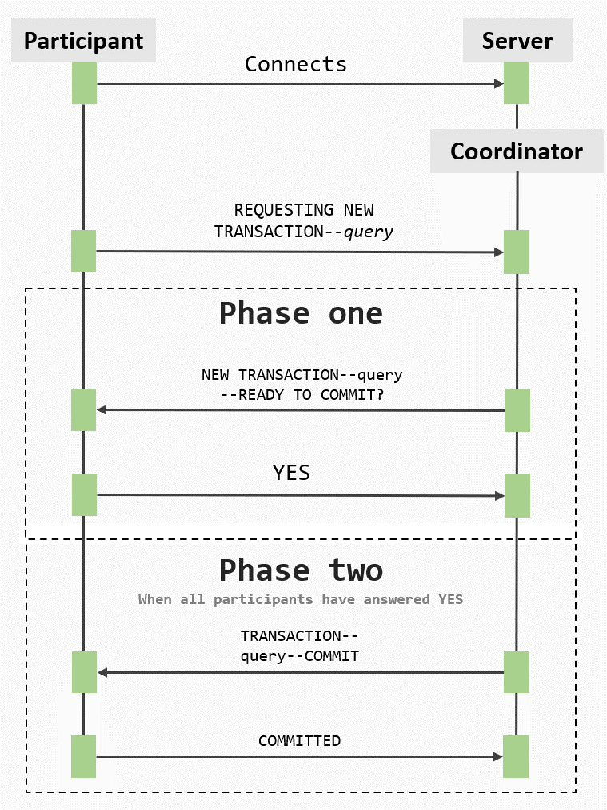
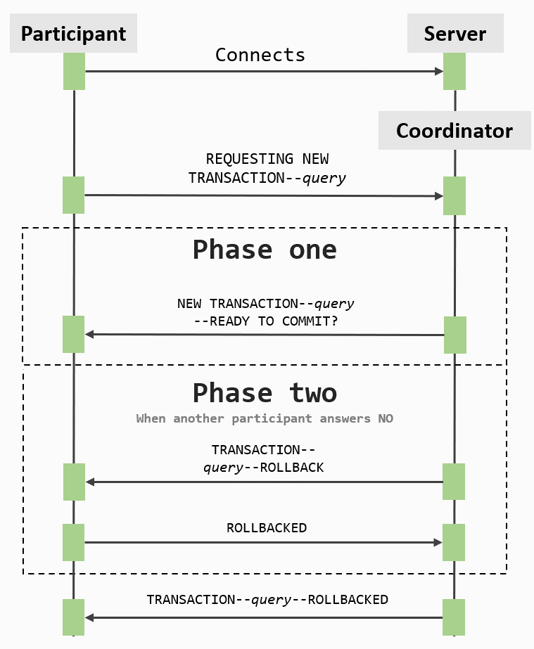
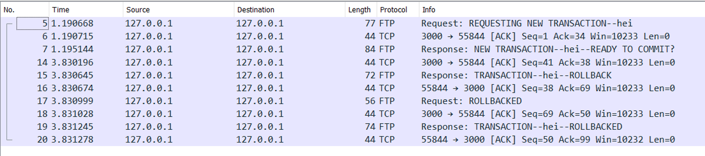
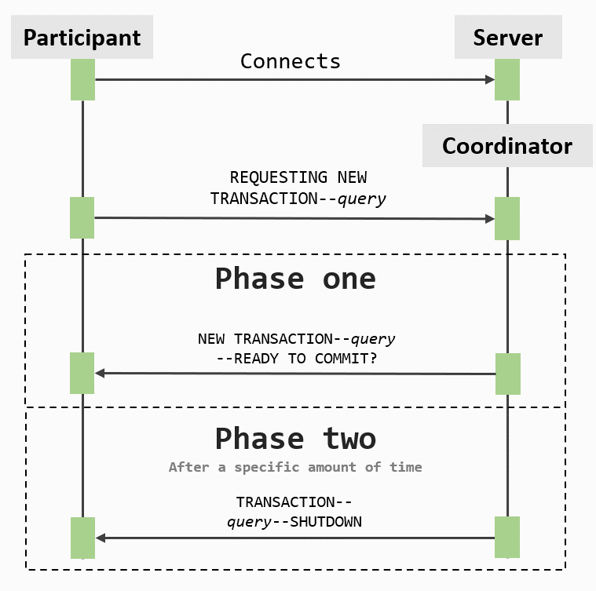
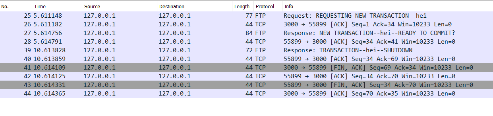
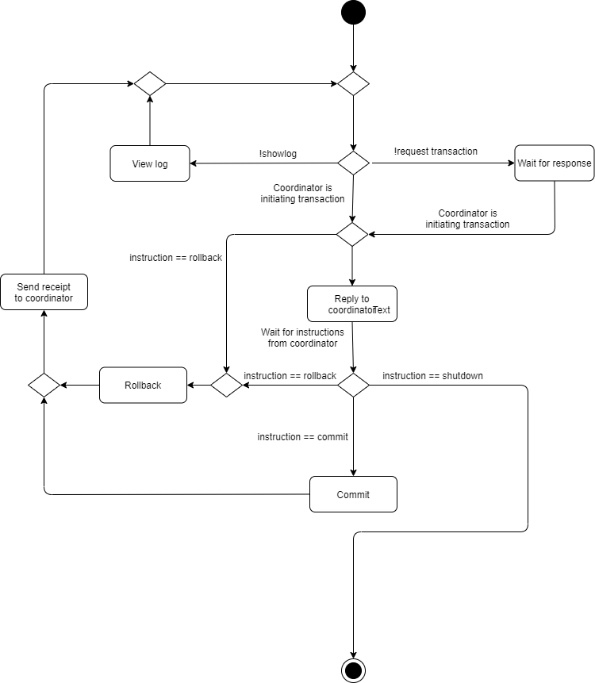

This project was done in connection to the course TDAT2004 - Datakommunikasjon med nettverksprogrammering. This README acts as the final report for the project. 

# Two-Phase Commit Protocol (TPCP)

## Innholdsfortegnelse

0. [Begrepsliste](#begrepsliste)
1. [Innledning](#innledning)
2. [Installasjonsinstruksjoner](#instruksjoner)
3. [API](#api)
4. [Continuous Integration](#ci)
5. [Beskrivelse](#beskrivelse)
   1. [Two-phase commit protocol](#tpcp)
   2. [TCP](#tcp)
   3. [Teamets implementasjon av Two-phase commit protocol](#teametsimplementasjon)
   4. [Implementert funksjonalitet](#implementertfunksjonalitet)
   5. [Eksempler med bruk av løsningen](#eksemplermedbruk)
      1. [Oversikt over utlegg i en vennegjeng](#eksempelutlegg)
      2. [Banksystem](#eksempelbank)
      3. [Vetorett](#eksempelveto)
   6. [Hvordan bruke løsningen](#hvordanbruke)
      1. [Vise loggen](#viselogg)
      2. [Sende forespørsel om en transaksjon og fullføre den](#sendeforespørsel)
6. [Diskusjon](#diskusjon)
   1. [Teknologi- og designvalg](#teknologi)
      1. [Valg av programmeringsspråk og nettverksprotokoll](#valgavprog)
      2. [Prosjektstruktur](#prosjektstruktur)
      3. [Kode](#kode)
         1. [Coordinator.java](#kodeCoordinator)
         2. [ClientHandler.java](#kodeClientHandler)
         3. [Participant.java](#kodeParticipant)
         4. [Server.java](#kodeServer)
         5. [Client.java](#kodeClient)
         6. [Client2.java og Client3.java](#kodeClient23)
      4. [Begrensninger](#begrensninger)
         1. [Ulovlige tegn i forespørsler](#ulovligetegn)
         2. [Lagring av logg](#lagringavlogg)
      5. [Biblioteker og verktøy](#biblioteker)
      6. [Håndtering av feil i fase 2](#håndteringfeilfase2)
      7. [Håndtering av timeout for klient](#håndteringtimeout)
   2. [Fremtidig arbeid](#fremtidigarbeid)
      1. [Mangler](#mangler)
      2. [Mulige forbedringer og tillegg](#forbedringer)
7. [Gruppemedlemmer](#gruppemedlemmer)
8. [Referanser](#referanser)

## <a name=”begrepsliste”></a> Begrepsliste

Under er en liste over begreper som brukes i denne rapporten.

**Atomisk operasjon**:
En operasjon som endrer på en tilstand uten noe mellomstadie.

**Transaksjon**:
Ramme for en handling som sikrer atomisk utførelse.

**Koordinator (Coordinator)**:
Node som distribuerer meldinger til andre noder og leder utførelsen av en transaksjon.

**Deltaker (Participant)**:
Node som deltar i transaksjoner.

**Query**:
Strengen som skal føres opp i deltakernes logg.

**WireShark**:
Program som fanger pakker som går gjennom nettverksadapteren på maskinen.

**Socket**:
Et endepunkt for en toveis-kommunikasjon over et ip-basert nettverk.(Nettverkssocket, Wikipedia, 2020)

**Kontinuerlig integrasjon (Continous integration, CI)**:
Å sjekke inn kode jevnlig til et repository med tester som verifiserer koden.

**Versjonskontroll**:
Et system som holder orden på endringer og versjoner av filer.

## <a name="innledning"></a> Innledning

I dette prosjektet er det blitt programmert en løsning som implementerer Two-Phase Commit Protocol (TPCP). Protokollen brukes i et nettverk av noder hvor alle skal utføre en handling hvis, og bare hvis alle andre gjør det. Nettverket består av en koordinator og en til flere deltakere. Løsningen er programmert i Java med TCP-kommunikasjon mellom tjener og klient.

## Installasjonsinstruksjoner (Installation guide) <a name="instruksjoner"></a>

```
1: Clone the project
2: Make sure you have JDK 10 installed (We used 10.0.2)
3: Compile and run Server.java
4: Compile Client.java, and run as many instances with no more than 10 seconds between each connection
```

## <a name="api"></a> API

[Lenke til JavaDoc](http://williad.pages.stud.idi.ntnu.no/tpcp/overview-summary.html)

## <a name="ci"></a> Continuous Integration

Teamet brukte GitLabs verktøy for CI til å kjøre tester.  
[Lenke til siste pipeline](https://gitlab.stud.idi.ntnu.no/williad/tpcp/pipelines/latest)

## <a name="beskrivelse"></a> Beskrivelse

### <a name="tpcp"></a> Two-phase commit protocol

Som navnet tilsier, deles Two-Phase Commit Protocol opp i to faser. Den generelle beskrivelsen av protokollen tar utgangspunkt i artikkelen Two-phase commit protocol på wikipedia.

Fase 1

I den første fasen mottar alle deltakerne melding fra koordinator om at en transaksjon er satt i gang. Klientene skal svare enten ja eller nei, basert på om de ønsker eller har mulighet til å committe. Fase 1 består da av to meldinger, en hver vei.

Fase 2

Om alle klientene stemte ja i forrige fase blir endringen lagret. Om en klient stemte nei blir transaksjonen kansellert.
Koordinatoren informerer da alle klientene og sørger for at ingen endringer blir lagret. I fase 2 sendes det altså en instruksjon fra koordinator til deltakerne. Deltakerne svarer så med en kvittering på at instruksjonen er fullført.

Denne protokollen er atomisk, som betyr at alle endringene skal skje tilsynelatende i én operasjon. Dette kan man se i fase 2 hvor koordinatoren instruerer alle til å enten lagre eller kansellere endringene. (Two-Phase Commit Protocol, Wikipedia, 2020)

### <a name="tcp"></a> TCP

I dette prosjektet er TCP blitt brukt for å kommunisere mellom tjener og klient.

TCP er en nettverksprotokoll som befinner seg på transportlaget i den forenklede OSI-lagmodellen. Det er en pålitelig nettverksprotokoll, som betyr at den sørger for at alle pakker kommer frem til målet. Dette oppnår TCP blant annet ved å bruke tre forskjellige flagg i pakkehodet, som er SYN (synchronize), ACK (acknowledge), FIN (finish).

Når en node skal sende pakker til en annen node må de først koble seg sammen. Det skjer gjennom en tre-veis handshake som begynner ved at node 1 sender en pakke med SYN-flagget, for å koble seg til. Node 2 svarer med SYN og ACK, for å bekrefte at den fikk pakken og at den også vil koble seg til. Til slutt sender node 1 en pakke med ACK-flagget, for å bekrefte at den mottok pakken fra node 2. Under er et utklipp fra WireShark som viser oppkoblingen. Oppkoblingen tar sted i de tre første pakkene.

<figure class="image">

<figcaption>Figur 1: Oppkobling mellom server og klient i wireshark</figcaption>
</figure>

Videre når nodene skal sende pakker til hverandre må de svare med ACK for å bekrefte at pakken kom frem. Om den ene noden ikke får bekreftelse på at pakken kom frem, blir pakken sendt på nytt.

FIN-flagget brukes til nedkobling. Nedkoblingen foregår på veldig lik måte som oppkoblingen, bare med FIN i stedet for SYN. Node 1 sender først FIN-flagget for å begynne nedkoblingen. Den mottar da ACK fra node 2. Litt senere sender node 2 igjen en pakke med FIN-flagget for å fortelle at den også begynner nedkobling. Node 1 svarer tilbake med ACK-flagget. (Hallsteinsen, Klefstad & Skundberg, 2008, s. 77-82)

### <a name="teametsimplementasjon"></a> Teamets implementasjon av Two-phase commit protocol

I tillegg til de grunnleggende meldingene som sendes mellom koordinator og deltakerne ble det lagt til noen flere, som bygger på protokollen. I figuren under ser man hvordan meldingsflyten foregår gjennom en vellykket transaksjon. Figuren tar utgangspunkt i perspektivet til en individuell deltaker.

<figure class="image">

<figcaption>Figur 2: Meldingsflyt i en vellykket transaksjon</figcaption>
</figure>

Under er et Wireshark-utklipp som viser en vellykket transaksjon :

<figure class="image">

<figcaption>Figur 3: Wireshark eksempel på en suksessfull transaksjon</figcaption>
</figure>

En deltaker sender først `REQUESTING NEW TRANSACTION--query` til koordinatoren. Fase 1 begynner med at koordinatoren opplyser alle deltakere om at det er satt igang en ny transaksjon. Deltakerne får da meldingen `NEW TRANSACTION--query--READY TO COMMIT?`. Tilbake til koordinator sendes da meldingen `YES`. I fase 2 mottar deltakerne `TRANSACTION--query--COMMIT`. Deltakeren sender tilbake `COMMITTED`, når instruksjonen er utført. Hvis deltakeren hadde svart `NO` i fase 1, ville den første meldingen i fase 2 blitt `TRANSACTION--query--ROLLBACK`, og deltakerne ville svart med `ROLLBACKED`.

I forklaringen ovenfor får man et overblikk over hvordan reglene i teamets implementasjon av protokollen er. Hver melding er en tekststreng, og må i noen tilfeller deles opp for å komme fram til komponentene den består av. Teamet løste dette ved å skille hver komponent med to bindestreker. Å bruke to bindestreker var løsningen på at teamet trengte et vilkårlig sett med tegn som brukeren sjeldent ville ønske å skrive i en oppføring. Komponentene, med unntak av selve oppføringen, har alltid store bokstaver. Grunnen til dette er for å gjøre protokollens meldingsflyt mer oversiktlig, og å skille oppføringen fra de andre kodeordene.

Meldingene som kommer fra koordinator under en transaksjon er alltid på formen `STATUS--query--INSTRUCTIONS`. Hvis status er `NEW TRANSACTION`, vet deltakerne at det settes igang en ny transaksjon. Den siste komponenten inneholder instruksjonene som skal følges. `READY TO COMMIT?` sørger for at brukeren blir spurt om den er med på oppføringen. Figur 2 og 3 illustrerte meldingsflyten i en vellykket transaksjon, men det er også to andre tilfeller som kan oppstå. Figuren under illustrerer meldingsflyten når en annen deltaker svarer `NO` i fase en.

<figure class="image">

<figcaption>Figur 4: Meldingsflyt i en transaksjon når en annen deltaker svarer NO</figcaption>
</figure>

Under er et Wireshark-utklipp som viser pakkeflyten om en deltaker svarer NO:

<figure class="image">

<figcaption>Figur 5: Wireshark eksempel på rollback i en transaksjon</figcaption>
</figure>

Figur 4 og 5 viser at så snart en deltaker svarer `NO` i transaksjonen, sender koordinator ut en melding til alle deltakerne som instruerer dem i å rulle tilbake. Deltakerne mottar denne meldingen selv om de ikke har svart ennå. Et annet tilfelle er hvis en deltaker ikke svarer under fase en. Koordinatoren vil etter en bestemt tid be den stumme deltakeren om å koble seg fra tjeneren. Dette ser man i figuren under.

<figure class="image">

<figcaption>Figur 6: Meldingsflyt i en transaksjon hvor deltakeren ikke svarer i tide</figcaption>
</figure>

Under er et Wireshark-utklipp som viser pakkeflyten om deltakeren ikke svarer i tide:

<figure class="image">

<figcaption>Figur 7: Wireshark eksempel på shutdown i en transaksjon</figcaption>
</figure>

### <a name="implementertfunksjonalitet"></a> Implementert funksjonalitet

Illustrasjonen er et aktivitetsdiagram for en deltaker, og viser kodeflyten.

<figure class="image">

<figcaption>Figur 8: Aktivitetsdiagram for en klient</figcaption>
</figure>

Applikasjonen tillater så mange klienter man ønsker å gjennomføre transaksjoner mellom. Transaksjonene bruker two-phase commit protocol, slik teamet tolka den. Det er også mulig for en klient å vise loggen over alle gjennomførte transaksjoner.

### <a name="eksemplermedbruk"></a> Eksempler med bruk av løsningen

Løsningen kan anvendes til ulike formål. Formålene har til felles at det er ønsket at alle som deltar i en aktivitet skal kunne ha tilgang til et eget dokument, hvor alle dokumenter til enhver tid skal være identiske. Alle skal også kunne ytre sin mening om en handling. Eksemplene tar utgangspunkt i at løsningen distribueres på den måten at den passer det spesifikke formålet. Altså at den ikke brukes ved å kjøre de kompilerte java-filene på datamaskinen, men for eksempel som en applikasjon på mobilen.

#### <a name="eksempelutlegg"></a> Oversikt over utlegg i en vennegjeng

Et eksempel på en anvendelse er hvis en person legger ut penger for andre. Man kan tenke seg en vennegjeng som er på ferie sammen og betaler med et bankkort for alle varene og maten de kjøper. Gjennom ferien vil det være greit å skrive ned hva hver person skylder den som eier bankkortet. Bestemmer man at en skal ha ansvar for å føre opp dette kan man risikere at denne personen jukser med verdiene i sin favør, slik at den kan betale mindre.

Tar man i bruk løsningen må alle i vennegjengen godkjenne en hver oppføring før den lagres. Gjør de dette mens de sitter på restauranten har de gjerne prisene friskt i minne, slik at de er sikre på at oppføringen er riktig. Når ferien nærmer sin slutt, og de er klare til å gjøre opp, tar de frem sine kopier. Skal noen ha klart å endre sin egen kopi, vil dette bli avdekket når kopiene sammenlignes. Dette eksemplet har likheter med blockchain innenfor kryptografi. (Blockchain, Wikipedia, 2020)

#### <a name="eksempelbank"></a> Banksystem

Et annet eksempel er et banksystem med overføring av penger mellom kontoer. Om man ikke har en form for atomisk transaksjon, og det skulle oppstå en feil, kan dette føre til at en konto blir trekt penger, men at den andre ikke får noe penger innsatt. Med two-phase commit protocol har kontoene alltid den samme loggen over overføringer mellom kontoer, så man vil ikke få dette problemet.

#### <a name="eksempelveto"></a> Vetorett

For en gruppe som skal avgjøre et sett med vedtak, og alle gruppemedlemmene har vetorett, kan denne løsningen brukes. FNs sikkerhetsråd fungerer på denne måten. Et av gruppemedlemmene sender en forespørsel som inneholder vedtaket. Hvert medlem skal da melde inn sin mening om saken. Hvis en av dem svarer nei, altså bruker sin vetorett, vil vedtaket ikke gå gjennom.

### <a name="hvordanbruke"></a> Hvordan bruke løsningen

Instruksjonene som presenteres i dette avsnittet forutsetter at du har gjennomført [installasjonsinstruksjonene](#instruksjoner). Etter dette skal du ha en instans av klassen Server.java som kjøres, og minst en instans av Client.java. Tjeneren lytter i 10 sekunder etter hver tilkobling før den stopper. Dette er da tidsrammen det er mulig å kople opp det antallet klienter som er ønsket.

På hver av klientene skal du se følgende melding som indikerer at de er tilkoblet tjeneren:

```
COORDINATOR: You are connected with id ‘integer’
```

Påfølgende meldinger er instruksjoner over ulike kommandoer du kan utføre. Disse presenteres under.

#### <a name="viselogg"></a> Vise loggen

Utenfor en transaksjon kan man skrive `!showlog` for å skrive ut loggen. Rett etter man har koblet seg opp vil loggen være tom og se slik ut:

```
-------------LOG-------------
-----------------------------
```

Fullfører man noen vellykkede transaksjoner vil man kunne se alle oppføringer i loggen.

```
-------------LOG-------------
Person A owes Person B 150 NOK
Person A owes Person C 500 NOK
Person B owes Person A 40 NOK
-----------------------------
```

#### <a name="sendeforespørsel"></a> Sende forespørsel om en transaksjon og fullføre den

En transaksjon settes i gang av en av deltakerne. Dette gjøres med kommandoen `!request ‘query’`. Alle deltakerne vil da motta en melding fra koordinator som spør om man sier seg enig i å lagre oppføringen. Hver klient svarer enten `YES` eller `NO`. Hvis man svarer `YES`, vil man vente på videre instruksjoner fra koordinator. Dette er fase 1 av protokollen.

Når alle klientene har svart ja, begynner fase 2. Koordinator vil da sende ut en ny melding hvor den instruerer deltakerne til å lagre oppføringen. Klientene sender tilbake kvittering om at instruksjonene er utført. Fase 2 skjer automatisk og krever ingen handlinger fra brukeren.

## <a name="diskusjon"></a> Diskusjon

### <a name="teknologi"></a> Teknologi- og designvalg

#### <a name="valgavprog"></a> Valg av programmeringsspråk og nettverksprotokoll

Til valg av programmeringsspråk hadde teamet flere muligheter. Teamet hadde tidligere brukt Java, JavaScript og C++ i øvingsarbeidet. Valg av programmeringsspråk hadde også konsekvenser for hvordan løsningen ville bli implementert, da med tanke på hvilke nettverksprotokoller man tar i bruk. En øving handlet om å utvikle en egen WebSocket-tjener ved hjelp av Node. C++ ble brukt tidlig i faget, men det ble ikke gjennomgått hvordan man setter opp tjenere med dette språket. Det ble til slutt bestemt at Java skulle brukes, da alle har erfaring med dette fra de begynte på studiet.

I to av øvingene i faget ble det anbefalt å bruke Java. I den ene øvingen skulle man sette opp en TCP-tjener, og i den andre en UDP-tjener. Med TCP kunne man overføre rene tekststrenger mellom klient og tjener, men i UDP måtte man konvertere mellom bytes og tekst. I TCP er man også sikker på at overføringen er pålitelig. I et system hvor en tjener skal koordinere flere klienter og sørge for at de utfører de samme instruksjonene er det positivt at eventuelle pakketap blir håndtert. Derfor ble det valgt å bruke TCP til systemet, med utgangspunkt i teamets kunnskaper fra Øving 4 hvor man skulle utvikle en kalkulatortjener.

#### <a name="prosjektstruktur"></a> Prosjektstruktur

Rot-mappen i repositoriet består av to undermapper. Den ene heter `documentation` og inneholder alle figurer og UML-diagrammer. Den andre heter `project`, og er den mappen teamet jobber i ved bruk av IntelliJ. For å kjøre enhetstester med GitLab CI måtte prosjektet være et Maven-prosjekt. Kodepakkene `client` og `server` ligger da under `root/project/src/main/java`. Testene ligger under `root/project/src/test/java`.

#### <a name="kode"></a> Kode

Prosjektet består av klassene som er beskrevet i delkapitlene under.

##### <a name="kodeCoordinator"></a> Coordinator.java

Coordinator koordinerer klientene som er koplet opp mot server. Klassen opprettes med en klientliste når server er ferdig å lytte etter klienter. Coordinator tolker data den mottar og sender riktige instruksjoner til riktig klient. Om transaksjonen blir kansellert sørger coordinator for å informere alle klientene at de må rulle tilbake transaksjonen. Klassen sørger også for at inaktive klienter blir terminert. Da rulles gjeldende transaksjon tilbake og gjenværende klienter kan initiere en ny.

##### <a name="kodeClientHandler"></a> ClientHandler.java

Klassen ClientHandler inneholder metoder for å sende meldinger til en deltaker fra koordinator og lese meldinger fra en deltaker. Klassen opprettes med en id for å identifisere hvilken klient som håndteres.

ClientHandler er en mellomklasse for Coordinator og Participant. Teamet valgte å implementere denne klassen for å få en mer distribuert kode. Et alternativ hadde vært å ha Coordinator og Participant kommunisere direkte, men å skille ut denne koden i en ekstra klasse fører til en mer oversiktlig kodestruktur.

##### <a name="kodeParticipant"></a> Participant.java

Klassen håndterer brukerinput og formaterer forespørsler før de sendes til koordinator. Hver instans av denne klassen vil ha en instans av ClientHandler hos koordinatoren som den kommuniserer med. Participant mottar meldinger fra koordinator og deler disse opp i dens komponenter for å finne instruksjonene den skal utføre. Klassen gir også muligheten for å vise loggen hvis brukeren ønsker det.

##### <a name="kodeServer"></a> Server.java

Sørger for å ta imot klienter som ønsker å ta del i transaksjonen. Teamet har satt en timer mellom hver oppkobling til å ikke overstige ti sekunder. Etter tiden er ute kan ikke flere klienter koble seg til denne instansen. Da opprettes et Coordinator-objekt som inneholder en liste med alle klientene som er med i transaksjonen, og start()-metoden for koordinatoren blir kjørt.
Videre sørger Server-klassen for at meldinger kan overføres mellom klassene.

##### <a name="kodeClient"></a> Client.java

Klassen inneholder en main-metode som oppretter en instans av klassen Participant og et socket-objekt tilkoblet tjeneren. Med socket-objektet som parameter, kjøres startConnection() for deltakeren i denne klassen. Client kjøres altså for å kople en deltaker opp mot tjeneren.

##### <a name="kodeClient23"></a> Client2.java og Client3.java

Disse klassene er kopier av Client. De ble laget for å bruke compound-funksjonen i IntelliJ, som gjør det mulig å starte flere klasser samtidig, men som ikke tillater at flere instanser av samme klasse kan startes samtidig.

Samarbeidet mellom klassene er illustrert i klassediagrammet under.

<figure class="image">

<figcaption>Figur 9: Klassediagram</figcaption>
</figure>

#### <a name="begrensninger"></a> Begrensninger

##### <a name="ulovligetegn"></a> Ulovlige tegn i forespørsler

Teamet har valgt at meldinger som sendes mellom klient og koordinator bruker “--” for å dele dem opp. Om en slik streng da ble sendt ved en forespørsel av en transaksjon, for eksempel “!request --”, ville serveren krasjet med en feilmelding “index out of bounds”. I flere deler av koden splittes meldingene på “--”. Da vil det også oppstå noen feil hvor gale komponenter hentes ut. Dette løste teamet ved å hindre brukeren i å sende forespørsler som inneholder en eller flere sekvenser av “--”.

##### <a name="lagringavlogg"></a> Lagring av logg

Oppføringene som skjer i transaksjonene lagres i en egen streng for hver instans av Participant. Når en klient avslutter, lagres ikke dette til noen fil. Dette betyr at tilstanden som opprettes under en sesjon ikke vil være tilgjengelig under en senere sesjon. Teamet tillot denne begrensningen, siden hvor man lagrer loggen vil avhenge av implementasjonen. Hadde det vært en nettside ville man heller ønsket å lagre loggen i en database. Teamet ønsket å gjøre løsningen så generell som mulig, og valgte derfor en spesifikk enkel måte å hente loggen på, altså brukerinput gjennom terminalen.

#### <a name="biblioteker"></a> Biblioteker og verktøy

Til dette prosjektet har teamet tatt i bruk ulike verktøy og biblioteker. Disse er presentert og forklart i tabellen under.

| Biblioteker og verktøy | Bruk                                                                                                                                                                                          |
| ---------------------- | --------------------------------------------------------------------------------------------------------------------------------------------------------------------------------------------- |
| GitLab                 | Brukes til samskriving, versjonskontroll og kontinuerlig integrasjon                                                                                                                          |
| IntelliJ               | IDE som hele teamet brukte                                                                                                                                                                    |
| JUnit                  | Brukes til enhetstesting                                                                                                                                                                      |
| Mockito                | Ble brukt til å mocke Socket-objekter under enhetstesting                                                                                                                                     |
| Maven                  | Håndterer avhengigheter til prosjektet. Hovedgrunnen til at det ble brukt i dette prosjektet var for å tillate enhetstester å kjøre i pipelinen på GitLab. Brukes også til å generere JavaDoc |
| java.util.ArrayList    | Arraylist ble brukt fordi den er enklere å jobbe med enn tabeller som er standard i Java                                                                                                      |
| java.util.Date         | Ble brukt for tidtagning                                                                                                                                                                      |
| java.util.Scanner      | Ble brukt for brukerinput                                                                                                                                                                     |
| java.util.concurrent   | Ble brukt for koble klienter til tjeneren innen et gitt tidsrom                                                                                                                               |
| java.net               | Socket-klassene Socket og ServerSocket ble brukt for kommunikasjon mellom tjener og klient                                                                                                    |
| java.io                | Nødvendig for bruk av Socket-objekter og for lesing og skriving mellom tjener og klient                                                                                                       |
| WireShark              | Brukt for å fange pakker                                                                                                                                                                      |

#### <a name="håndteringfeilfase2"></a> Håndtering av feil i fase 2

Slik teamet tolket two-phase commit protocol ut fra wikipedia-artikkelen kan ikke en deltaker trekke seg etter fase 1. Da skal deltakerne bare committe endringene. Om det skulle skje noe som gjør at deltakeren ikke får gjort det, er det ikke protokollen sitt ansvar å håndtere dette. Å håndtere eventuelle feil som kan oppstå i fase 2, for eksempel at en deltaker mister forbindelsen, ville også krevd mye tid og ressurser å lage. Av disse to grunnene ble det derfor bestemt å ikke håndtere feil i fase 2.

#### <a name="håndteringtimeout"></a> Håndtering av timeout for klient

Under stemmeprosessen i fase 1 får klienten et valg om å stemme ja/nei om de vil bli med på transaksjonen som er satt i gang. I denne prosessen har teamet valgt å implementere en timer mens koordinator venter på svar. Dette er for å løse problemet med en inaktiv klient, eller en klient som av en eller annen grunn ikke får svart. Etter at tiden går ut blir klienten kastet ut, og transaksjonen den var en del av rulles tilbake. Videre kan gjenværende klienter fortsette ved å opprette en ny transaksjon.

### <a name="fremtidigarbeid"></a> Fremtidig arbeid

Selv om teamet er fornøyde med produktet er det noen ting som kunne blitt gjort bedre med mer tid. I tillegg er det noe funksjonalitet som teamet ønsket å implementere, men ikke hadde tid til. Under vil det bli listet mangler teamet føler applikasjonen har og mulige forbedringer.

#### <a name="mangler"></a> Mangler

En mangel applikasjon har er at det ikke er mulig for en deltaker å avslutte tilkoblingen selv. En deltaker kan bare bli avsluttet dersom den bruker for lang tid på svare koordinatoren i fase 1, eller om prosessen blir terminert.

Under utviklingen forsøkte teamet å lage enhetstester for Participant.java. Denne klassen tar utgangspunkt i SocketKlient-klassen fra øving 4, og bruker en while-loop som i hver iterasjon sjekker om det er noe brukerinput eller meldinger fra koordinatoren. Med denne løsningen var det derimot vanskelig å lage tester da loopen ville blokkere for tester helt til den var ferdig. Teamet forsøkte å kjøre denne klassen i en egen tråd og opprette et InputStream-objekt for å sende brukerinput gjennom. Etter mye problemer ble det valgt å ikke lage noen tester for denne klassen. Teamet sørget derimot for å utføre mange utforskende tester på applikasjonen for å lete etter feil. Dette gjelder også Coordinator.java, som kjører en while-loop og sjekker om den får noen henvendelser fra deltakerne.

#### <a name="forbedringer"></a> Mulige forbedringer og tillegg

Tidlig i prosjektet var planen å utvikle løsningen slik at en deltaker kunne invitere andre tilkoblede deltakere i en gruppe som ville ha en egen koordinator. Teamet innså raskt at dette ville kreve mye ressurser og at det ikke ville bidra til å løse den gitte oppgaven om å implementere protokollen. Skulle teamet jobbet videre med prosjektet ville dette være et tillegg som hadde vært interessant å utvikle.

All interaksjon med applikasjonen er ved hjelp av tekst-kommandoer gjennom en terminal. Dersom prosjektet skulle jobbes videre med hadde en mulig forbedring vært å lage et grafisk brukergrensesnitt for applikasjonen. Dette kunne gjort det enklere å følge gangen i prosessen og å interagere med den, som hadde gjort hele applikasjonen mer brukervennlig.

Applikasjonen er mer eller mindre bare en demonstrasjon av two-phase commit protocol. Ved videre arbeid kunne det vært interessant å anvende protokollen i et system. Et eksempel på dette kunne vært å lage et banksystem hvor man kan overføre penger mellom kontoer.

Man kan bare legge til klienter i et gitt tidsrom etter at tjeneren er blitt startet. Om man ønsker å legge til flere må man starte tjeneren og alle klientene på nytt. Teamet valgte å gjøre dette fordi det ikke nødvendigvis gir mening for en ny klient å godta en tidligere transaksjonslogg ved oppkobling. Imidlertid ville det vært en nyttig egenskap for applikasjonen å ha, og kunne derfor kanskje blitt implementert ved videre arbeid.

## <a name="gruppemedlemmer"></a> Gruppemedlemmer

Magnus Baugerud  
William Dalheim  
Asbjørn Fiksdal Kallestad

## <a name=”referanser”></a> Referanser

Two-phase commit protocol. (n.d.). Wikipedia. hentet 20.april 2020, fra https://en.wikipedia.org/wiki/Two-phase_commit_protocol

Nettverkssocket. (n.d) Wikipedia. Hentet 21.april 2020, fra https://no.wikipedia.org/wiki/Nettverkssocket

Blockchain. (n.d) Wikipedia. Hentet 21.april 2020, fra https://en.wikipedia.org/wiki/Blockchain

Hallsteinsen, Ø, Klefstad, B., & Skundberg, O. (2008). Innføring i datakommunikasjon. Gyldendal akademisk.
